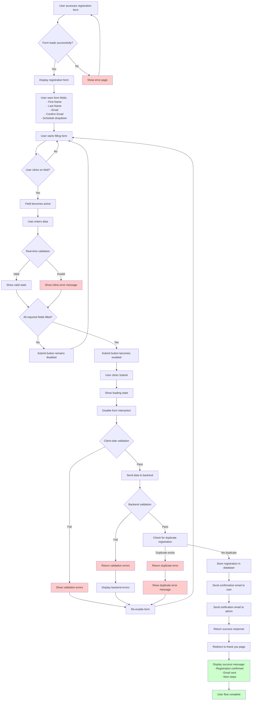

# User Flow: Class Registration Form

## Overview

This document outlines the complete user flow for the class registration form, from initial access to successful registration confirmation.

## User Flow Diagram

## Detailed Flow Steps

### 1. Initial Access

- **Entry Point**: User navigates to registration form URL
- **Expected Behavior**: Form loads with all fields empty and submit button disabled
- **Error Handling**: If form fails to load, show error page with retry option

### 2. Form Interaction

- **Field Activation**: User clicks on any field to begin data entry
- **Real-time Validation**: Each field validates as user types
- **Visual Feedback**:
  - Valid fields show green checkmark or no error
  - Invalid fields show red error message below field
  - Required fields show asterisk (*) indicator

### 3. Field-Specific Validation

- **First Name/Last Name**:
  - Required
  - Minimum 2 characters
  - Only letters and spaces allowed
- **Email**:
  - Required
  - Valid email format (`user@domain.com`)
  - No spaces allowed
- **Confirm Email**:
  - Required
  - Must match email field exactly
- **Schedule**:
  - Required
  - Must select from available time slots

### 4. Form Submission

- **Pre-submission**: All validations must pass
- **Loading State**: Submit button shows spinner, form becomes non-interactive
- **Client-side Validation**: Final check before sending to backend
- **Backend Submission**: Data sent to Express.js API

### 5. Backend Processing

- **Server Validation**: Additional server-side validation
- **Duplicate Check**: Verify no existing registration with same email
- **Database Storage**: Store registration in MongoDB/PostgreSQL
- **Email Notifications**: Send confirmation and admin notification emails

### 6. Success Flow

- **Success Response**: Backend returns success status
- **Redirect**: User automatically redirected to thank you page
- **Confirmation**: Display success message with registration details

### 7. Error Handling

- **Validation Errors**: Show specific error messages below each field
- **Network Errors**: Show generic error message with retry option
- **Duplicate Registration**: Show specific message about existing registration
- **Server Errors**: Show generic error message with contact information

## Key Decision Points

### D1: Form Load Success

- **Success Path**: Continue to form display
- **Error Path**: Show error page with retry mechanism

### D2: Field Validation

- **Valid Path**: Continue to next field or enable submit
- **Invalid Path**: Show error message and prevent submission

### D3: Form Completion

- **Complete Path**: Enable submit button
- **Incomplete Path**: Keep submit button disabled

### D4: Backend Validation

- **Success Path**: Process registration and send emails
- **Error Path**: Return to form with error messages

### D5: Duplicate Check

- **No Duplicate Path**: Continue with registration
- **Duplicate Path**: Show error message and prevent registration

## User Experience Considerations

### Visual Feedback

- Loading states for all async operations
- Clear error messages with actionable guidance
- Success indicators for completed steps
- Disabled states for unavailable actions

### Accessibility

- Keyboard navigation support
- Screen reader compatibility
- High contrast error states
- Clear focus indicators

### Mobile Responsiveness

- Touch-friendly form elements
- Appropriate input types for mobile keyboards
- Responsive layout for different screen sizes
- Optimized loading times for mobile networks

## Error Recovery

### Form Validation Errors

- User can correct errors and resubmit
- Form retains entered data (except passwords)
- Clear indication of which fields need attention

### Network Errors

- Automatic retry mechanism
- Manual retry option
- Clear error messaging
- Alternative contact methods

### Server Errors

- Graceful error handling
- User-friendly error messages
- Fallback options for critical failures
- Support contact information
